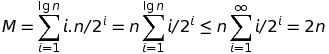
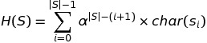
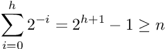
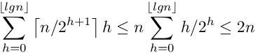

# Basic concepts related to programming

## <a name='table_of_contents'></a>Table of contents:
1. [Common Data-structures](#common_data_structures)
    1. [Arrays](#arrays)
    2. [Recursive Objects](#recursive_objects)
    3. [Dictionaries](#dictionaries)
        1. [Comparing Dictionary Implementations](#comparing_dictionary_implementation)
    4. [Binary Search Trees](#binary_search_tree)
    5. [Priority Queue](#priority_queue)
        1. [Basic Priority Queue Implementation](#basic_priority_queue_implementation)
    6. [Hashing and String](#hashing_and_string)
        1. [Collision Resolution](#collision_resolution)
    7. [Specialised Data Structures](#specialised_data_structures)
2. [Sorting and Searching](#sorting_and_searching)
    1. [Application of Sorting](#application_of_sorting)
    2. [Order of Sorting](#order_of_sorting)
    3. [Heap-sort: Fast Sorting via Data Structures](#heap_sort)
        1. [Heaps](#heaps)
        2. [Constructing Heaps](#constructing_heaps)
        3. [Extracting the Minimum](#extracting_minimum)
        4. [Faster Heap Construction](#faster_heap_construction)
    4. [Sorting by Incremental Insertion](#sorting_by_incremental_insertion)
    5. [MergeSort: Sorting by Divide-and-Conquer](#merge_sort)
    6. [QuickSort: Sorting by Randomization](#quick_sort)
        1. [Intuition: The Expected Case for QuickSort](#expected_case_for_quick_sort)
        2. [Randomised Algorithms](#randomized_algorithm)
3. [Important Questions](#important_questions)
4. [Problems Wiki](#problem_wiki)
4. [Data Structures and Concepts](#important_data_structures_and_concepts)
5. [Mathematical formulas and their Proofs](#math_formulas_and_proofs)
6. [Mathematical concepts and Algorithms](#mathematical_concepts_and_algorithm)
7. [Puzzles](#puzzles)


## <a name='common_data_structures'></a> Common Data Structures

- Contiguous vs. Linked Data Structures:
  - Data structures can be neatly classified as either contiguous or linked, depending
upon whether they are based on arrays or pointers:
    - `Contiguously-allocated` structures are composed of single slabs of 
    memory, and include arrays, matrices, heaps, and hash tables.
    
    - `Linked data structures` are composed of distinct chunks of memory 
    bound together by `pointers`, and include lists, trees, and 
    graph adjacency lists.


### <a name='arrays'></a> Arrays:

Advantages of contiguously-allocated arrays include:
- `Constant-time access given the index` – Because the index of each element
maps directly to a particular memory address, we can access arbitrary data
items instantly provided we know the index.

- `Space efficiency` – Arrays consist purely of data, so no space is wasted with
links or other formatting information. Further, `end-of-record` information is
not needed because arrays are built from `fixed-size` records.

- `Memory locality` – A common programming idiom involves iterating through
all the elements of a data structure. Arrays are good for this because they
exhibit excellent `memory locality`. `Physical continuity` between `successive data`
accesses helps exploit the `high-speed cache memory` on modern computer
architectures.

- Downside: As size is fixed, it can't be adjusted in the middle of
the program.

  - Actually, we can efficiently enlarge arrays as we need them, through the miracle
  of `dynamic arrays`. Suppose we start with an array of size 1, and double its size from
  `m` to `2m` each time we run out of space. This doubling process involves allocating a
  new contiguous array of size `2m`, copying the contents of the old array to the lower
  half of the new one, and returning the space used by the old array to the storage
  allocation system.

  - The apparent waste in this procedure involves the `recopying of the old contents`
  on each expansion. How many times might an element have to be recopied after a
  total of `n` insertions?

  - Well, the first inserted element will have been recopied when
  the array expands after the first, second, fourth, eighth, . . . insertions. It will take
  log<sub>2</sub> n doublings until the array gets to have `n` positions.

  - However, most elements do not suffer much upheaval. Indeed, the `(n/2 + 1)st` 
  through `nth` elements will move at most once and might never 
  have to move at all.

  - If `half the elements` move `once`, a `quarter of the elements` `twice`, and so on, the
  total number of movements `M` is given by
  
  
  - Thus, each of the `n` elements move only `two times` on average, and the total work
  of managing the `dynamic array` is the same `O(n)` as it would have been if a single
  array of sufficient size had been allocated in advance!
  
  - The primary thing lost using dynamic arrays is the `guarantee` that `each array
  access` takes `constant time` in the `worst case`. Now all the queries will be fast, 
  except for those relatively few queries `triggering array doubling`. What we get 
  instead is a `promise` that the `nth` array access will be completed quickly enough 
  that the `total effort` expended so far will still be `O(n)`. Such `amortized guarantees` 
  arise frequently in the analysis of data structures.


[Table of contents](#table_of_contents)

### <a name='recursive_objects'></a> Recursive objects
- `Lists` – Chopping the first element off a linked list leaves a `smaller linked list`.
This same argument works for `strings`, since removing characters from string
leaves a string. Lists are `recursive objects`.

- `Arrays` – Splitting the first `k` elements off of an `n` element array gives two
smaller arrays, of size `k` and `n − k`, respectively. Arrays are `recursive objects`.


### <a name='dictionaries'></a> Dictionaries

The `dictionary` data type permits access to data items by content. 
You stick an item into a dictionary so you can find it when you 
need it.

The primary operations of dictionary support are:
- `Search(D,k)` – Given a search key `k`, return a pointer to the element in 
dictionary `D` whose key value is `k`, if one exists.

- `Insert(D,x)` – Given a data item `x`, add it to the set in the dictionary `D`.

- `Delete(D,x)` – Given a pointer to a given data item `x` in the dictionary `D`,
  remove it from `D`.

Certain dictionary data structures also efficiently support other useful 
operations:

- `Max(D)` or `Min(D)` – Retrieve the item with the `largest` (or `smallest`) key 
from `D`. This enables the dictionary to serve as a `priority queue`.

- `Predecessor(D,k)` or `Successor(D,k)` – Retrieve the item from `D` whose key is
immediately before (or after) `k` in sorted order. These enable us to iterate
through the elements of the data structure.

>Many common data processing tasks can be handled using these dictionary
operations. For example, suppose we want to remove all duplicate names from a
mailing list, and print the results in sorted order.
>
>Initialize an empty dictionary D, whose search key will be the record name. 
Now read through the mailing list, and for each record search to see if the 
name is already in D. If not, insert it into D.
>
>Once finished, we must extract the remaining names out of the dictionary.
By starting from the first item Min(D) and repeatedly calling Successor until we
obtain Max(D), we traverse all elements in sorted order.


[Table of contents](#table_of_contents)


### <a name='comparing_dictionary_implementation'></a>Comparing Dictionary Implementation
**Problem**:
>What are the asymptotic worst-case running times for each of the seven
fundamental dictionary operations (search, insert, delete, successor, predecessor,
minimum, and maximum) when the data structure is implemented as:
> - An unsorted array
> - A sorted array

**Solution**:

This problem reveal some of the inherent trade-offs 
of data structure design. A given data representation may permit efficient 
implementation of certain operations at the cost that other operations 
are expensive.

In addition to the array in question, we will assume access to a 
few extra variables such as `n`—the number of elements currently in 
the array. Note that we must maintain the value of these variables 
in the operations where they change (e.g., `insert` and `delete`), 
and `charge these operations` the cost of this `maintenance`.

The basic dictionary operations can be implemented with the following costs
on unsorted and sorted arrays, respectively:

| Dictionary Operation | Unsorted Array | Sorted Array  |
| :------------------: | :------------: | :-----------: |
| Search(L, k)         | O(n)           | O(log n)      |
| Insert(L, x)         | O(1)           | O(n)          |
| Delete(L, x)         | O(1)*          | O(n)          |
| Successor(L, x)      | O(n)           | O(1)          |
| Predecessor(L, x)    | O(n)           | O(1)          |
| Minimum(L)           | O(n)           | O(1)          |
| Maximum(L)           | O(n)           | O(1)          |


`Deletion` is somewhat trickier, hence the superscript( ∗ ) in the table. 
The definition states that we are given a pointer `x` to the element to 
delete, so we need not spend any time searching for the element. But 
removing the `xth` element from the array `A` leaves `a hole` that must 
be filled. We could fill the `hole` by moving each of the elements 
`A[x + 1]` to `A[n]` up `one position`, but this requires `Θ(n)` time 
when the first element is deleted. The following idea is better: 
just write over `A[x]` with `A[n]`, and decrement `n`. This only takes
`constant time`.

Implementing a dictionary using a `sorted array` completely `reverses` 
our notions of what is `easy` and what is `hard`. Searches can now be 
done in `O(log n)` time, using `binary search`, because we know the 
`median element` sits in `A[n/2]`. Since the upper and lower portions of 
the array are also `sorted`, the `search` can continue recursively on the 
appropriate portion. The number of `halvings of n` until we get to a 
single element is `Math.ceil(lg n)`.

>Data structure design must balance all the different operations it 
supports. The fastest data structure to support both operations `A` and `B` 
may well `not` be the `fastest structure` to support either `operation A` or
`B`.

**Note**: We can charge a operation some extra money (which will be asymptotically 
same), to make some other critical operation faster.
For example, If an operation is taking `O(n)` and another one is also
taking `O(n)` but if we do some processing(may be another loop, so the 
effective complexity would remain O(n)) in the first operation then
the next operation would be `O(1)`.


[Table of contents](#table_of_contents)


### <a name='binary_search_tree'></a> Binary Search Trees

We have seen data structures that allow `fast search` or `flexible update`, 
but not `fast search` and `flexible update`.  
`Unsorted`, `doubly-linked` lists supported `insertion` and
`deletion` in `O(1)` time but `search` took `linear time` in the worse case.
`Sorted arrays` support `binary search` and `logarithmic query times`, but 
at the cost of `linear-time update`.

Binary search requires that we have fast access to two elements—specifically
the median elements above and below the given node.  To combine these ideas, 
we need a `linked list` with `two pointers per node`. This is the basic 
idea behind `binary search trees`.

A `rooted binary tree` is recursively defined as either being 
- empty, or 
- consisting of a node called the `root`, together with two rooted binary 
trees called the left and right subtrees, respectively.

A `binary search tree` labels each node in a `binary tree` with a `single 
key` such that for any `node labeled x`, `all nodes` in the `left subtree` 
of `x` have `keys < x` while all nodes in the `right subtree` of `x` have 
`keys > x`. This `search tree labeling` scheme is `very special`. For any 
`binary tree` on `n` nodes, and any set of `n` keys, there is `exactly one` 
labeling that makes it a `binary search tree`.


**Finding minimum and maximum element in a tree**:

>Implementing the `find-minimum` operation requires knowing where the 
minimum element is in the tree. By definition, the `smallest key` must 
reside in the `left subtree` of the `root`, since all keys in the 
`left subtree` have values less than that of the `root`. The minimum 
element must be the `leftmost` descendent of the root. Similarly, the 
maximum element must be the rightmost descendent of the root.

```c
tree *find_minimum(tree *t)
{
    tree *min;                  /* pointer to minimum */
    if (t == NULL) return(NULL);
    min = t;
    while (min->left != NULL)
        min = min->left;
    return(min);
}
```

**Insertion in a tree**:
> There is only one place to insert an item `x` into a `binary search tree` 
`T` where we know we can find it again. We must replace the `NULL` pointer 
found in `T` after an `unsuccessful query` for the `key k`.
>
>This implementation uses `recursion` to combine the `search` and `node 
insertion` stages of `key insertion`. The three arguments to insert tree 
are
> - a pointer `l` to the `pointer linking` the `search subtree` to the 
`rest of the tree`,
> - the key `x` to be inserted, and 
> - a `parent pointer` to the `parent node` containing `l`.

```c
insert_tree(tree **l, item_type x, tree *parent)
{
    tree *p;                /* temporary pointer */
    if (*l == NULL) {
        p = malloc(sizeof(tree)); /* allocate new node */
        p->item = x;
        p->left = p->right = NULL;
        p->parent = parent;
        *l = p;                 /* link into parent’s record */
        return;
    }
    if (x < (*l)->item)
        insert_tree(&((*l)->left), x, *l);
    else
        insert_tree(&((*l)->right), x, *l);
}
```

Allocating the node and `linking` it in to the tree is a `constant-time` 
operation after the `search` has been `performed` in `O(h)` time.


**Deletion from a Tree**:
>Deletion is somewhat trickier than insertion, because removing a node 
means appropriately linking its two descendant subtrees back into the 
tree somewhere else. There are three cases:
> - `Leaf nodes` have `no children`, and so may be `deleted` by simply 
`clearing` the pointer to the `given node`.
> - The case of the `doomed node` having `one child` is also straightforward. 
There is `one parent` and `one grandchild`, and we can `link the grandchild` 
directly to the `parent` without `violating` the `in-order` labeling property 
of the tree.
> - But what of a to-be-deleted node with `two children`? Our solution is 
to `relabel` this node with the `key` of its `immediate successor` in 
`sorted order`. This `successor` must be the `smallest value` in the 
`right subtree`, specifically the `leftmost descendant` in the `right 
subtree (p)`. Moving this to the `point of deletion` results in a 
properly-labeled `binary search tree`, and reduces our `deletion problem` 
to physically removing a node with at most `one child`—a case that has 
been resolved above.


> A binary tree can have `heights` ranging from `lg n` to `n`. But how 
`tall are they on average`? The `average case` analysis of algorithms can 
be `tricky` because we must `carefully` specify what `we mean by average`. 
The question is well defined if `we consider each of the n!` possible insertion 
orderings `equally likely` and average over those. If so, we are in luck, 
because with `high probability` the resulting `tree` will have `O(log n)` 
height.
>
> This argument is an important example of the power of `randomization`. 
We can often develop simple algorithms that offer good performance with 
`high probability`. We will see that a similar idea underlies the fastest 
known sorting algorithm, `quicksort`.


[Table of contents](#table_of_contents)


### <a name='priority_queue'></a> Priority Queues

`Priority queues` are data structures that provide more flexibility than 
`simple sorting`, because they allow `new elements` to enter a system at 
arbitrary intervals. It is much more `cost-effective` to insert a new job 
into a `priority queue` than to `re-sort` everything on each such arrival.

The basic priority queue supports three primary operations:
- `Insert(Q,x)`– Given an item `x` with key `k`, insert it into the 
`priority queue Q`.
- `Find-Minimum(Q)` or `Find-Maximum(Q)`– Return a pointer to the item 
whose `key` value is `smaller` (`larger`) than any other key in the 
`priority queue Q`.
- `Delete-Minimum(Q)` or `Delete-Maximum(Q)`– Remove the item from the 
`priority queue Q` whose `key` is minimum (maximum).


[Table of contents](#table_of_contents)

### <a name='basic_priority_queue_implementation'></a> Basic Priority Queue Implementation

**Problem**:
> What is the worst-case time complexity of the three basic priority queue
operations (`insert`, `find-minimum`, and `delete-minimum`) when the basic 
data structure is
> - An unsorted array
> - A sorted array
> - A balanced binary search tree

**Solution**:
>There is surprising subtlety in implementing these three operations, even
 when using a data structure as simple as an unsorted array. The unsorted array
 dictionary implemented `insertion` and `deletion` in `constant time`, and 
 `search` and minimum in `linear time`.  
 A `linear time` implementation of `delete-minimum` can be composed from 
 `find-minimum`, followed by `search`, followed by `delete`.
>
>For sorted arrays, we can implement `insert` and `delete` in `linear time`,
 and `minimum` in `constant time`. However, all `priority queue` `deletions` 
 involve only the `minimum element`. By `storing` the `sorted array` in `reverse` 
 order (largest value on top), the `minimum element` will be the `last one` 
 in the array. `Deleting` the `tail element` requires `no movement` of any 
 items, just decrementing the number of remaining items n, and so 
 `delete-minimum` can be implemented in `constant time`.
>
> All this is fine, yet the following table claims we can implement `find-minimum`
  in `constant time` for each data structure:
  
|                   | Unsorted Array | Sorted Array | Balanced Tree |
|:------------:     | :-----------:  | :----------: | :-----------: |
| Insert(Q, x)      | O(1)           | O(n)         | O(log n)      |
| Find-Minimum(Q)   | O(1)           | O(1)         | O(1)          |
| Delete-Minimum(Q) | O(n)           | O(1)         | O(log n)      |

> The trick is using an `extra variable` to store a `pointer/index` to the `minimum`
  entry in each of these structures, so we can simply return this value whenever we
  are asked to `find-minimum`.
>
> Updating this pointer on each insertion is easy—we update it if and only 
  if the newly inserted value is `less than the current minimum`.
>
> But what happens on a `delete-minimum`? We can `delete` the `minimum entry` 
  `have`, then do an `honest find-minimum` to restore our `canned value`. 
  The `honest find-minimum` takes `linear time` on an `unsorted array` and 
  `logarithmic time` on a `tree`, and hence can be `folded` into the `cost` 
  of each `deletion`.

[Table of contents](#table_of_contents)

### <a name='hashing_and_string'></a> Hashing and String

`Hash tables` are a very practical way to maintain a `dictionary`. They 
exploit the fact that `looking an item` up in an `array` takes `constant 
time` once you have its index. A `hash function` is a `mathematical function`
that maps `keys to integers`. We will use the `value of our hash function` 
as an `index` into an `array`, and `store` our item at that `position`.

The first step of the hash function is usually to map each key to a 
big integer. Let `α` be the size of the alphabet on which a given 
string `S` is written. Let `char(c)` be a function that maps each 
symbol of the `alphabet` to a `unique integer` from `0` to `α − 1`. 
The function  
  
maps `each string` to a `unique` (but large) integer by treating the 
characters of the string as “digits” in a `base-α` number system.

The result is `unique identifier` numbers, but they are `so large` 
they will quickly `exceed` the number of `slots` in our `hash table`
(denoted by `m`). We must reduce this number to an integer between 
`0` and `m−1`, by taking the remainder of `H(S) mod m`.
This works on the same principle as a `roulette wheel`. The ball 
travels a `long distance` around and around the `circumference-m` 
wheel `Math.floor( H(S)/m )` times before settling down to a `random bin`. 
If the `table size` is selected with `enough finesse` 
(ideally `m` is a `large prime` not too close to 2<sup>i</sup> − 1), 
the resulting hash values should be `fairly uniformly distributed`.


### <a name='collision_resolution'></a> Collision Resolution

No matter how good our hash function is, we had better be prepared 
for collisions, because `two distinct keys` will occasionally 
`hash to the same value`.

- `Chaining` is the `easiest approach` to `collision resolution`. 
Represent the `hash table` as an `array of m linked lists`.
The `ith` list will contain all the items that hash to the value of `i`.
Thus `search`, `insertion`, and `deletion` reduce to the corresponding
problem in `linked lists`.

    - If the `n keys` are `distributed uniformly` in a table, each list
    will contain roughly `n/m` elements, making them a `constant size` when 
    `m ≈ n`.

    - `Chaining` is `very natural`, but devotes a considerable amount of memory 
    to `pointers`. This is space that could be used to make the table larger, 
    and hence the "lists" smaller.

- The alternative is something called `open addressing`.
    - The hash table is maintained as an `array of elements` (not buckets), 
      each initialized to `null`.
    - On an `insertion`, we check to see if the desired position is `empty`.
      If so, we `insert` it. If not, we must find some other place to insert
      it instead.
    - The simplest possibility (called `sequential probing`) inserts the item 
      in the `next open spot` in the table.
    - If the `table` is `not too full`, the contiguous runs of items should 
      be `fairly small`, hence this `location` should be only a few slots 
      from its `intended position`.
    - `Searching` for a given key now involves going to the appropriate hash 
      value and checking to see if the item there is the one we want. If so,
      return it. Otherwise we must keep checking through the length of
      the run.
    - `Deletion` in an `open addressing scheme` can get `ugly`, since removing
       one element might `break a chain of insertions`, making some elements
       inaccessible. We have `no alternative` but to `reinsert` all the items 
       in the run following the `new hole`.

[Table of contents](#table_of_contents)

### <a name='specialised_data_structures'></a> Specialised Data Structures
- `String data structures` – Character strings are typically represented by 
   arrays of characters, perhaps with a special character to mark the end of 
   the string. `Suffix trees/arrays` are special data structures that preprocess 
   strings to make `pattern matching` operations `faster`.
   
- `Geometric data structures` – Geometric data typically consists of collections 
   of `data points and regions`. `Regions` in the `plane` can be described by 
   `polygons`, where the `boundary of the polygon` is given by a `chain of line 
   segments`. `Polygons` can be represented using an `array of points` 
   (v<sub>1</sub> , . . . , v<sub>n</sub> , v<sub>1</sub> ), such that (v<sub>i</sub> , v<sub>i+1</sub> ) 
   is a `segment` of the `boundary`. `Spatial data structures` such as
   `kd-trees` organize `points and regions` by `geometric location` to 
   support `fast search`.

- `Graph data structures` – Graphs are typically represented using either 
   `adjacency matrices` or `adjacency lists`. The choice of representation 
   can have a substantial impact on the design of the resulting `graph 
   algorithms`.

- `Set data structures` – `Subsets of items` are typically represented using 
   a dictionary to support `fast membership queries`. Alternately, `bit vectors` 
   are `boolean arrays` such that the i<sup>th</sup> bit represents `true` 
   if `i` is in the `subset`.

## <a name='sorting_and_searching'></a> Sorting and Searching

### <a name='application_of_sorting'></a> Application of `sorting`:

1. **Searching**: Binary search tests whether an item is in a dictionary in `O(log n)` time, provided the keys are all sorted. `Search preprocessing` is perhaps the single most important application of `sorting`.

2. **Closest pair**: Given a set of n numbers, how do you find the pair of numbers that have the `smallest difference` between them? Once the numbers are `sorted`, the closest pair of numbers must lie next to each other somewhere in sorted order. Thus, a `linear-time` scan through them completes the job, for a total of `O(n log n)` time including the sorting.

3. **Element Uniqueness**: Are there any `duplicates` in a given set of n items? This is a `special case` of the `closest-pair` problem above, where we ask if there is a pair separated by a gap of zero. The `most efficient` algorithm `sorts the numbers` and then does a `linear scan` though checking all adjacent pairs.

4. **Frequency Distribution**: Given a set of n items, which element occurs the `largest number` of times in the set? If the items are sorted, we can `sweep` from `left to right` and count them, since all identical items will be lumped together during sorting. 
To find out how often an arbitrary element k occurs, look up k using binary search in a sorted array of keys. By walking to the left of this point until the first the element is not k and then doing the same to the right, we can find this count in `O(log n + c)` time, where `c` is the number of `occurrences of k`.
Even better, the number of instances of `k` can be found in `O(log n)` time by using `binary search` to look for the positions of both `k − e` and `k + e` (where
`e` is arbitrarily small) and then taking the difference of these positions.

5. **Selection**: What is the `k`<sup>th</sup> largest item in an array? If the keys are placed in sorted order, the `k`<sup>th</sup> largest can be found in `constant time` by simply looking at the `k`<sup>th</sup> position of the array. In particular, the median element (see Section 14.3 (page 445)) appears in the `(n/2)`<sup>nd</sup> position in sorted order.

6. **Convex hulls**: What is the polygon of `smallest area` that contains a given set of `n` points in two dimensions? The `convex hull` is like a `rubber band` `stretched over the points in the plane and then released`. It compresses to just cover the points, as shown in Figure 4.1(l). The `convex hull` gives a nice representation of the shape of the points and is an important building block for more sophisticated geometric algorithms, as discussed in the catalog in Section 17.2 (page 568).  
But how can we use sorting to construct the convex hull? Once you have the points sorted by `x-coordinate`, the points can be inserted from left to right into the hull. Since the `right-most point` is always on the `boundary`, we know that it will appear in the `hull`. Adding this new `right-most` point may cause others to be deleted, but we can quickly identify these points because they lie inside the polygon formed by adding the new point. See the example in Figure 4.1(r). These points will be neighbors of the previous point we inserted, so they will be easy to find and delete. The total time is linear after the sorting has been done.


[Table of contents](#table_of_contents)

### <a name='order_of_sorting'></a> Order of Sorting:

1. **increasing or decreasing order?**: A set of keys S are sorted in `ascending` order when S<sub>i</sub> ≤ S<sub>i+1</sub> for all 1 ≤ i < n. They are in `descending` order when S<sub>i</sub> ≥ S<sub>i+1</sub> for all 1 ≤ i < n. Different applications call for different orders.

2. **sorting just the key or an entire record?**: Sorting a data set involves `maintaining the integrity` of `complex data` records. A mailing list of names, addresses, and phone numbers may be sorted by names as the `key field`, but it had better `retain the linkage` between `names` and `addresses`. Thus, we need to `specify` which `field is the key field` in any complex record, and understand the full extent of each record.

3. **what should we do with equal key?**: Elements with `equal` key values will all bunch together in any total order, but sometimes the relative order among these keys matters. Suppose an encyclopedia contains both `Michael Jordan(the basketball player)` and `Michael Jordan (the statistician)`. Which entry should appear first? You may need to `resort to secondary keys`, such as article size, to resolve ties in a meaningful way.  
Sometimes it is required to leave the items in the `same relative order` as in the `original permutation`. Sorting algorithms that automatically enforce this requirement are called `stable`. Unfortunately `few fast algorithms` are `stable`. `Stability` can be achieved for any sorting algorithm by `adding the initial position` as a `secondary key`.  
Of course we could make no decision about equal key order and let the ties fall where they may. But beware, certain efficient sort algorithms (such as `quick-sort`) can run into `quadratic performance trouble` unless `explicitly engineered` to deal with `large numbers of ties`.

4. **what about non-numerical data?**: Alphabetizing is the sorting of text strings. Libraries have very complete and complicated rules concerning the `relative collating sequence` of characters and punctuation. Is `Skiena` the same key as `skiena`? Is `Brown-Williams` before or after `Brown America`, and before or after `Brown, John`?  

    The right way to specify such matters to your sorting algorithm is with an application-specific pairwise-element `comparison function`. Such a `comparison function` takes pointers to record items a and b and returns “<” if a < b, “>” if a > b, or “=” if a = b.
    
    
[Table of contents](#table_of_contents)


### <a name='heap_sort'></a> HeapSort: Fast Sorting via Data Structures

We start with `data structure` design, because one of the most `dramatic algorithmic improvements` via `appropriate data structures` occurs in `sorting`. `Selection sort` is a simple-to-code algorithm that repeatedly extracts the smallest remaining element from the unsorted part of the set:

```c
    SelectionSort(A):
        For i = 1 to n do
            Sort[i] = Find-Minimum from A
            Delete-Minimum from A
        Return(Sort)
```

A `C` language implementation of `selection sort` appeared back in Section 2.5.1(page 41). There we `partitioned` the input array into `sorted` and `unsorted` regions. To find the `smallest item`, we performed a `linear sweep` through the `unsorted portion` of the array.

The `smallest item` is then `swapped` with the `i`<sup>th</sup> item in the array before moving on to the next iteration. `Selection sort` performs `n` iterations, where the average iteration takes `n/2` steps, for a total of O(n<sup>2</sup>) time.  
But what if we improve the `data structure`? It takes `O(1)` time to remove a particular item from an `unsorted array` once it has been located, but `O(n)` time to find the `smallest item`. These are exactly the operations supported by `priority queues`.  
So what happens if we `replace` the `data structure` with a `better priority queue` implementation, either a `heap` or a `balanced binary tree`? Operations within the loop now take `O(log n)` time each, instead of `O(n)`. Using such a `priority queue implementation` speeds up `selection sort` from O(n<sup>2</sup>) to O(n log n).  
The name typically given to this algorithm, `heapsort`, `obscures` the relationship between them, but `heapsort` is nothing but an `implementation of selection sort` using the `right data structure`.

[Table of contents](#table_of_contents)

#### <a name='heaps'></a> Heaps:

Heaps are a simple and elegant data structure for efficiently supporting the `priority queue` operations `insert` and `extract-min`. They work by maintaining a `partial order` on the set of elements which is `weaker` than the `sorted order` (so it can be efficient to maintain) yet `stronger` than `random order` (so the minimum element can be quickly identified).  

Power in any hierarchically-structured organization is reflected by a `tree`, where each `node` in the tree represents a `person`, and `edge (x, y)` implies that `x` directly `supervises` (or dominates) `y`. The fellow at the root sits at the “top of the heap.”

In this spirit, a `heap-labeled tree` is defined to be a `binary tree` such that the `key labeling` of each `node` `dominates` the `key labeling` of each of its `children`. In a `min-heap`, a node `dominates` its `children` by containing a `smaller key` than they do, while in a `max-heap` `parent nodes` dominate by being `bigger`.


The above figure presents a min-heap ordered tree of red-letter years in American history (kudos to you if you can recall what happened each year).

The most natural implementation of this binary tree would store each key in a `node with pointers` to its two children. As with binary search trees, the `memory used by the pointers` can easily `outweigh` the `size of` keys, which is the data we are really interested in.

The heap is a slick data structure that enables us to represent binary trees `without` using `any pointers`. We will store data as `an array of keys`, and `use the position` of the keys to `implicitly satisfy` the role of the pointers.

We will store the `root of the tree` in the `first position` of the array, and its `left and right` children in the `second` and `third` positions, respectively. In general, we will store the 2<sup>l</sup> keys of the `l`<sup>th</sup> level of a complete binary tree from left-to-right in positions 2<sup>l−1</sup> to 2<sup>l</sup> − 1, as shown in Figure 4.2(r). We assume that the array `starts` with `index 1` to simplify matters.

```c
typedef struct {
    item_type q[PQ_SIZE+1];  /* body of queue */
    int n;  /* number of queue elements */
} priority_queue;
```

What is especially nice about this representation is that the positions of the parent and children of the key at position `k` are readily determined. The `left child` of `k` sits in position `2k` and the `right child` in `2k + 1`, while the parent of `k` holds court in position 	`floor(n/2)`. Thus we can move around the tree without any pointers.

```c
pq_parent(int n)
{
    if (n == 1) return(-1);  
    else return((int) n/2);  /* implicitly take floor(n/2) */
}

pq_young_child(int n)
{
    return(2 * n);
}

```

So, we can store any binary tree in an array without pointers. What is the catch? Suppose our height `h` tree was `sparse`, meaning that the number of nodes n < 2<sup>h</sup> . All missing internal nodes still take up space in our structure, since we must represent a full binary tree to maintain the positional mapping between parents and children.

Space efficiency thus demands that we not allow holes in our tree—i.e., that each level be packed as much as it can be. If so, only the last level may be incomplete. By packing the elements of the last level as far to the left as possible, we can represent an `n-key` tree using exactly `n` elements of the array. If we did not enforce these structural constraints, we might need an array of size 2<sup>n</sup> to store the same elements. Since all but the last level is always filled, the height `h` of an `n` element heap is logarithmic because:



so `h = floor(lg n)`.  
This implicit representation of binary trees saves memory, but is less flexible than using pointers. We cannot store arbitrary tree topologies without wasting large amounts of space. We cannot move subtrees around by just changing a single pointer, only by explicitly moving each of the elements in the subtree. This loss of flexibility explains why we cannot use this idea to represent `binary search trees`, but it works just fine for `heaps`.

**Problem**: How can we efficiently search for a particular key in a heap?
**Solution**: We can’t. Binary search does not work because a `heap` is `not` a `binary search tree`. We know almost nothing about the relative order of the `n/2` leaf elements in a `heap`—certainly nothing that lets us avoid doing linear search through them.

#### <a name='constructing_heaps'></a> Constructing Heaps:

Heaps can be constructed incrementally, by inserting each new element into the `left-most` open spot in the array, namely the (n + 1)<sup>st</sup> position of a previously `n-element` heap. This ensures the desired balanced shape of the `heap-labeled` tree, but does not necessarily maintain the dominance ordering of the keys. The new key might be less than its parent in a `min-heap`, or greater than its parent in a `max-heap`.

The solution is to `swap` any such `dissatisfied` element with its `parent`. The old parent is now happy, because it is properly dominated. The other child of the old parent is still happy, because it is now dominated by an element even more extreme than its previous parent. The new element is now happier, but may still dominate its new parent. We now recur at a higher level, `bubbling up` the new key to its proper position in the hierarchy. Since we replace the root of a subtree by a larger one at each step, we preserve the heap order elsewhere.

```c
pq_insert(priority_queue *q, item_type x)
{
    if (q->n >= PQ_SIZE)
        printf("Warning: priority queue overflow insert x=%d\n",x);
    else {
        q->n = (q->n) + 1;
        q->q[ q->n ] = x;
        bubble_up(q, q->n);
    }
}

bubble_up(priority_queue *q, int p)
{
    if (pq_parent(p) == -1) return; /* at root of heap, no parent */
    if (q->q[pq_parent(p)] > q->q[p]) {
        pq_swap(q,p,pq_parent(p));
        bubble_up(q, pq_parent(p));
    }
}

```

This `swap` process takes `constant time` at each level. Since the height of an `n-element` heap is `lg n`, each insertion takes at most `O(log n)` time. Thus an initial heap of `n` elements can be constructed in `O(n log n)` time through `n` such insertions:

```c
pq_init(priority_queue *q)
{
    q->n = 0;
}

make_heap(priority_queue *q, item_type s[], int n)
{
    int i;     /* counter */
    pq_init(q);
    for (i=0; i<n; i++)
        pq_insert(q, s[i]);
}

```

#### <a name='extracting_minimum'></a> Extracting the Minimum:

The remaining priority queue operations are identifying and deleting the dominant element. Identification is easy, since the top of the heap sits in the first position of the array.  

Removing the top element leaves a hole in the array. This can be filled by moving the element from the `right-most` leaf (sitting in the `n`<sup>th</sup> position of the array) into the first position.

The shape of the tree has been restored but (as after insertion) the labeling of the root may no longer satisfy the heap property. Indeed, this new root may be dominated by both of its children. The root of this `min-heap` should be the `smallest` of three elements, namely the `current root` and its `two children`. If the `current root` is dominant, the heap order has been restored. If not, the dominant child should be swapped with the root and the problem pushed down to the next level.

This dissatisfied element `bubbles down` the heap until it dominates all its children, perhaps by becoming a leaf node and ceasing to have any. This `percolate-down` operation is also called **`heapify`**, because it merges two heaps (the subtrees below the original root) with a new key.

```c
item_type extract_min(priority_queue *q)
{
    int min = -1;   /* minimum value */
    if (q->n <= 0) printf("Warning: empty priority queue.\n");
    else {
        min = q->q[1];
        q->q[1] = q->q[ q->n ];
        q->n = q->n - 1;
        bubble_down(q,1);
    }
    return(min);
}

bubble_down(priority_queue *q, int p)
{
    int c;  /* child index */
    int i;  /* counter */
    int min_index;  /* index of lightest child */
    
    c = pq_young_child(p);
    min_index = p;
    
    for (i=0; i<=1; i++)
        if ((c+i) <= q->n) {
            if (q->q[min_index] > q->q[c+i]) min_index = c+i;
        }
        
    if (min_index != p) {
        pq_swap(q,p,min_index);
        bubble_down(q, min_index);
    }
}

```

We will reach a leaf after `floor(lg n)` bubble down steps, each constant time. Thus root deletion is completed in `O(log n)` time.

Exchanging the maximum element with the last element and calling `heapify` repeatedly gives an `O(n log n)` sorting algorithm, named `Heapsort`.

```c
heapsort(item_type s[], int n)
{
    int i;  /* counters */
    priority_queue q;   /* heap for heapsort */

    make_heap(&q,s,n);
    
    for (i=0; i<n; i++)
        s[i] = extract_min(&q);
}
```

`Heapsort` is a great sorting algorithm. It is simple to program; indeed, the complete implementation has been presented above. It runs in worst-case `O(n log n)` time, which is the best that can be expected from any sorting algorithm. It is an `in-place` sort, meaning it uses `no extra memory` over the array containing the elements to be sorted. Although other algorithms prove slightly faster in practice, you won’t go wrong using `heapsort` for sorting data that sits in the computer’s main memory.


#### <a name='faster_heap_construction'></a> Faster Heap Construction:

As we have seen, a heap can be constructed on `n` elements by incremental insertion in `O(n log n)` time. Surprisingly, heaps can be constructed even faster by using our `bubble down` procedure and some clever analysis.

Suppose we pack the `n` keys destined for our `heap` into the first `n` elements of our `priority-queue` array. The shape of our heap will be right, but the dominance order will be all messed up. How can we restore it?

Consider the array in `reverse order`, starting from the last (n<sup>th</sup>) position. It represents a leaf of the tree and so dominates its nonexistent children. The same is the case for the last `n/2` positions in the array, because all are leaves. If we continue to walk backwards through the array we will finally encounter an internal node with children. This element may not dominate its children, but its children represent well-formed (if small) heaps.

This is exactly the situation the `bubble down` procedure was designed to handle, restoring the heap order of arbitrary root element sitting on top of two `sub-heaps`. Thus we can create a heap by performing `n/2` non-trivial calls to the `bubble down` procedure:

Multiplying the number of calls to `bubble down` `(n)` times an upper bound on the cost of each operation `(O(log n))` gives us a running time analysis of `O(n log n)`. This would make it no faster than the `incremental insertion` algorithm described above.

But note that it is indeed an `upper bound`, because only the last insertion will actually take 	`lg n` steps. Recall that `bubble down` takes time proportional to the `height of the heaps` it is merging. Most of these heaps are extremely small. In a full binary tree on n nodes, there are n/2 nodes that are leaves (i.e. , height 0), n/4 nodes that are height 1, n/8 nodes that are height 2, and so on. In general, there are at most `ceil`(n/2<sup>h+1</sup>) nodes of height `h`, so the cost of building a heap is:



Since this sum is not quite a `geometric series`, we can’t apply the usual identity to get the sum, but rest assured that the puny contribution of the numerator (h) is crushed by the denominator (2<sup>h</sup>). The series quickly `converges` to `linear`.

Does it matter that we can construct heaps in `linear time` instead of `O(n log n)`? Usually not. The construction time did not dominate the complexity of `heapsort`, so improving the construction time does not improve its worst-case performance. Still, it is an impressive display of the power of careful analysis, and the free lunch that `geometric series` convergence can sometimes provide.

[Table of contents](#table_of_contents)

### <a name='sorting_by_incremental_insertion'></a> Sorting by Incremental Insertion

Insertion sort:

```c
InsertionSort(A)
    A[0] = −∞
    for i = 2 to n do
        j = i
        while (A[j] < A[j − 1]) do
            swap(A[j], A[j − 1])
            j = j − 1
```

Although `insertion sort` takes O(n<sup>2</sup>) in the worst case, it 
performs considerably better if the data is `almost sorted`, since `few 
iterations` of the `inner loop` suffice to sift it into the proper 
position.

`Insertion sort` is perhaps the simplest example of the `incremental insertion` 
technique, where we build up a `complicated structure` on `n items` by 
first building it on `n−1 items` and then making the necessary changes to 
add the `last item`. `Incremental insertion` proves a particularly useful 
technique in `geometric algorithms`.


### <a name='merge_sort'></a> MergeSort: Sorting by Divide-and-Conquer

`Recursive algorithms` reduce `large problems` into `smaller ones`. A 
`recursive approach` to `sorting` involves `partitioning` the elements 
into `two groups`, `sorting` each of the `smaller problems` `recursively`, 
and then `interleaving` the `two sorted lists` to totally `order` the 
elements. This algorithm is called `mergesort`, recognizing the importance
of the `interleaving operation`:

```c
Mergesort(A[1, n])
    Merge( MergeSort(A[1, n/2]), MergeSort(A[n/2 + 1, n]) )
```

The `basis case` of the `recursion` occurs when the sub-array to be sorted 
consists of a `single element`, so `no rearrangement` is possible.

The efficiency of `mergesort` depends upon how efficiently we combine the 
`two sorted halves` into a `single sorted list`. We could concatenate them 
into `one list` and call `heapsort` or some other `sorting algorithm` to do 
it, but that would just `destroy` all the work spent `sorting` our component
lists.

What is the total running time of `mergesort`? It helps to think about how 
much work is done at each level of the execution tree. If we assume for 
simplicity that `n` is a `power of two`, the `kth level` consists of all 
the 2<sup>k</sup> calls to `mergesort` processing sub-ranges of n/2<sup>k</sup> 
elements.

The work done on the `(k = 0)th` level involves merging `two sorted lists`, 
each of size `n/2`, for a total of at most `n − 1` comparisons. The work 
done on the `(k = 1)th` level involves `merging` `two pairs of sorted lists`, 
each of size `n/4`, for a total of at most `n−2` comparisons. In general, 
the work done on the `kth` level involves merging 2<sup>k</sup> pairs 
`sorted list`, each of size n/2<sup>k+1</sup> , for a total of at 
most n − 2<sup>k</sup> comparisons.

`Linear work` is done merging all the elements on each level. Each of 
the `n` elements appears in exactly one sub-problem on each level. 
The most expensive case (in terms of comparsions) is actually the 
top level.

The number of elements in a sub-problem gets `halved` at `each level`. 
Thus the number of times we can `halve` `n` until we get to `1` is 
**Math.ceil(lg<sub>2</sub> n)**.

Because the recursion goes `lg n` levels deep, and a `linear amount` of 
work is done per level, `mergesort` takes `O(n log n)` time in the 
worst case.
- `Mergesort` is a great algorithm for `sorting linked lists`, because 
  it does not rely on `random access` to elements as does `heapsort` or 
  `quicksort`.
  
- Its primary disadvantage is the need for an `auxilliary buffer` when 
  sorting arrays. It is easy to merge `two sorted linked lists` without 
  using any `extra space`, by just `rearranging the pointers`.
  
```c
mergesort(item_type s[], int low, int high)
{
    int i;                  /* counter */
    int middle;             /* index of middle element */
    if (low < high) {
        middle = (low+high)/2;
        mergesort(s,low,middle);
        mergesort(s,middle+1,high);
        merge(s, low, middle, high);
    }
}
```

```c
merge(item_type s[], int low, int middle, int high)
{
    int i;              /* counter */
    queue buffer1, buffer2; /* buffers to hold elements for merging */
    init_queue(&buffer1);
    init_queue(&buffer2);
    for (i=low; i<=middle; i++) enqueue(&buffer1,s[i]);
    for (i=middle+1; i<=high; i++) enqueue(&buffer2,s[i]);
    i = low;
    while (!(empty_queue(&buffer1) || empty_queue(&buffer2))) {
        if (headq(&buffer1) <= headq(&buffer2))
            s[i++] = dequeue(&buffer1);
        else
            s[i++] = dequeue(&buffer2);
    }
    while (!empty_queue(&buffer1)) s[i++] = dequeue(&buffer1);
    while (!empty_queue(&buffer2)) s[i++] = dequeue(&buffer2);
}
```

[Table of contents](#table_of_contents)


### <a name='quick_sort'></a> QuickSort: Sorting by Randomization

Suppose we select a `random item` `p` from the `n items` we seek to sort. 
`Quicksort` separates the `n − 1` other items into `two piles`: 
- a `low pile` containing all the elements that appear `before p` in sorted 
  order and 
- a `high pile` containing all the elements that appear `after p` in sorted 
  order. 

`Low` and `high` denote the `array positions` we place the respective piles, 
leaving a `single slot` between them for `p`.

Such `partitioning` buys us `two things`. 
- First, the `pivot element p` ends up in the `exact array position` it will 
  reside in the the `final sorted order`. 
- Second, `after partitioning` no element `flops` to the `other side` in the 
  `final sorted order`. 

Thus `we can now sort the elements to the left and the right of the pivot 
independently`! This gives us a `recursive sorting algorithm`, since we can 
use the `partitioning approach` to `sort` each `sub-problem`. The algorithm 
must be correct since each element ultimately ends up in the `proper 
position`:

```c
quicksort(item_type s[], int l, int h)
{
    int p;              /* index of partition */
    if ((h-l)>0) {
        p = partition(s,l,h);
        quicksort(s,l,p-1);
        quicksort(s,p+1,h);
    }
}
```
```c
int partition(item_type s[], int l, int h)
{
    int i;              /* counter */
    int p;              /* pivot element index */
    int firsthigh;      /* divider position for pivot element */
    
    p = h;
    firsthigh = l;
    for (i=l; i<h; i++)
        if (s[i] < s[p]) {
            swap(&s[i],&s[firsthigh]);
            firsthigh ++;
        }
    
    swap(&s[p],&s[firsthigh]);
    
    return(firsthigh);
}
```

Since the `partitioning step` consists of at most `n swaps`, it takes 
`linear time` in the `number of keys`. But how long does the entire 
`quicksort` take? As with `mergesort`, `quicksort` builds a `recursion 
tree` of `nested sub-ranges` of the `n-element array`. As with `mergesort`, 
`quicksort` spends `linear time` processing (now `partitioning` instead of
`mergeing`) the elements in each sub-array on each level. As with 
`mergesort`, `quicksort` runs in `O(n · h)` time, where `h` is the height 
of the `recursion tree`.

The difficulty is that the `height of the tree` depends upon where the 
`pivot element` ends up in `each partition`. If we get very lucky and 
happen to repeatedly pick the `median element` as our `pivot`, the 
`sub-problems` are always `half the size` of the `previous level`. The 
`height` represents the `number of times` we can `halve` `n` until we 
get down to `1`, or at most **Math.ceil(lg<sub>2</sub> n)**.

Now suppose we consistently get `unlucky`, and our `pivot element` always 
`splits` the `array` as `unequally` as possible. This implies that the 
`pivot element` is always the `biggest` or `smallest` element in the 
`sub-array`. After this `pivot` settles into its `position`, we are left 
with one `sub-problem of size n − 1`. We spent `linear work` and reduced 
the size of our problem by `one measly element`. It takes a tree of height 
`n − 1` to chop our array down to `one element per level`, for a worst 
case time of Θ(n<sup>2</sup>).

Thus, the worst case for `quicksort` is `worse` than `heapsort` or `mergesort`. 
To justify its name, `quicksort` had better be good in the `average case`. 
Understanding why requires some intuition about `random sampling`.

[Table of contents](#table_of_contents)

#### <a name='expected_case_for_quick_sort'></a> Intuition: The Expected Case for QuickSort

The `expected performance` of `quicksort` depends upon the `height of the 
partition tree` constructed by `random pivot elements` at each step. 
`Mergesort` ran in `O(n log n)` time because we split the keys into two 
equal halves, sorted them recursively, and then merged the halves in 
`linear time`. Thus, whenever our `pivot element` is `near` the `center` 
of the `sorted array` (i.e. , the `pivot` is close to the `median element`), 
we get a `good split` and `realize the same performance as mergesort`.

I will give an intuitive explanation of why `quicksort` is `O(n log n)` in 
the `average case`. How likely is it that a `randomly selected pivot` is a 
good one? The best possible selection for the `pivot` would be the `median 
key`, because `exactly half of elements` would end up `left`, and `half 
the elements` right, of the `pivot`. Unfortunately, we only have a 
`probability` of `1/n` of `randomly selecting the median as pivot`, which 
is quite small.

Suppose a `key` is a `good enough pivot` if it lies is in the `center half` 
of the `sorted space` of keys—i.e. , those ranked from `n/4` to `3n/4` in 
the `space of all keys` to be sorted. Such good enough `pivot elements` are 
quite plentiful, since `half the elements` lie closer to the `middle` 
than one of the two ends. Thus, on `each selection` we will pick a 
`good enough pivot` with `probability of 1/2`.

Can you `flip a coin` so it comes up `tails each time`? `Not without cheating`. 
If you flip a `fair coin` `n times`, it will come out `heads` about `half 
the time`. Let `heads denote` the chance of `picking a good enough pivot`.

The `worst possible good enough pivot` leaves the `bigger half` of the 
`space partition` with `3n/4 items`. What is the height h<sub>g</sub> of a 
`quicksort partition tree` constructed repeatedly from the `worst-possible` 
`good enough pivot`? The deepest path through this tree passes through 
partitions of size n, (3/4)n, (3/4)<sup>2</sup> n, . . ., down to 1. How
many times can we multiply `n` by `3/4` until it gets down to `1`?

(3/4)<sup>h<sub>g</sub></sup> n = 1 ⇒ n = (4/3)<sup>h<sub>g</sub></sup>

so h<sub>g</sub> = log<sub>4/3</sub> n.

But only `half of all randomly selected pivots` will be `good enough`. The 
rest we classify as `bad`.

The worst of these `bad pivots` will do essentially `nothing` to `reduce
the partition size` along the `deepest path`. The `deepest path` from the 
`root` through a typical `randomly-constructed` `quicksort partition tree` 
will pass through roughly `equal numbers` of `good-enough` and `bad pivots`. 
Since the expected number of `good splits` and `bad splits` is the `same`, 
the `bad splits` can only `double the height of the tree`, so 
h ≈ 2h<sub>g</sub> = 2 log<sub>4/3</sub> n, which is clearly `Θ(log n)`.

On average, `random quicksort partition trees` (and by analogy, `binary search
trees` under `random insertion`) are `very good`. More careful analysis shows 
the `average height` after `n insertions` is approximately `2 ln n`. Since 

>2 ln n ≈ 1.386 lg<sub>2</sub> n

this is only `39%` taller than a `perfectly balanced binary tree`. Since 
`quicksort` does `O(n)` work `partitioning on each level`, the average 
time is `O(n log n)`. If we are `extremely unlucky` and our randomly 
selected elements always are among the `largest` or `smallest` element 
in the array, `quicksort` turns into `selection sort` and runs in 
O(n<sup>2</sup> ). However, the odds against this are `vanishingly small`.

[Table of contents](#table_of_contents)

#### <a name='randomized_algorithm'></a> Randomized Algorithms

There is an important subtlety about the expected case `O(n log n)` running 
time for `quicksort`. Our `quicksort` implementation above selected the 
`last element` in each sub-array as `the pivot`. Suppose this program were 
given a `sorted array` as input. If so, at each step it would pick the 
`worst possible pivot` and run in `quadratic time`.

For any `deterministic method` of `pivot selection`, there exists a 
`worst-case` input instance which will `doom` us to `quadratic time`. 
The analysis presented above made no claim stronger than:
> “QuickSort runs in Θ(n log n) time, with high probability, if you give
  me randomly ordered data to sort.”
  
But now suppose we add an `initial step` to our algorithm where we 
`randomly permute` the order of the `n elements` before we try to 
`sort them`. Such a `permutation` can be constructed in `O(n)` time. 
This might `seem like wasted effort`, but it provides the `guarantee` 
that `we can expect Θ(n log n) running time` whatever the initial input 
was. The `worst case` performance `still can happen`, but it depends only 
upon how `unlucky we are`. There is no longer a `well-defined` 
“worst case” input. We now can say
> “Randomized quicksort runs in Θ(n log n) time on any input, with high
  probability.”

Alternately, we could get the `same guarantee` by `selecting a random 
element` to be the `pivot at each step`.

`Randomization` is a powerful tool to `improve algorithms` with `bad 
worst-case` but `good average-case` complexity. It can be used to make 
`algorithms` more `robust to boundary cases` and `more efficient` on 
highly structured input instances that confound `heuristic decisions` 
(such as `sorted input to quicksort`). It often lends itself to simple 
algorithms that provide `randomized performance guarantees` which
are otherwise obtainable only using `complicated deterministic algorithms`.

Some of the approaches to designing efficient randomized algorithms 
are readily explainable:

- `Random sampling` – Want to get an idea of the `median value` of `n things` 
   but don’t have either the `time or space` to look at them all? Select a 
   `small random sample` of the `input` and `study those`, for the results 
   should be representative.
   - This is the idea behind `opinion polling`. Biases creep in unless you 
   take a truly `random sample`, as `opposed` to the `first x` people you 
   happen to see. To `avoid bias`, actual `polling agencies` typically dial 
   `random phone numbers` and hope `someone answers`.

- `Randomized hashing` – We have claimed that `hashing` can be used to 
   implement dictionary operations in `O(1)` “expected-time.” However, 
   for any `hash function` there is a `given worst-case set of keys` 
   that `all get hashed to the same bucket`. But now suppose we `randomly 
   select our hash function` from a large family of `good ones` as the 
   `first step` of our algorithm. We get the same type of `improved 
   guarantee` that we did with `randomized quicksort`.
   
- `Randomized search` – Randomization can also be used to drive `search 
   techniques` such as `simulated annealing`

**Note**:
> QuickSort is 2-3 times faster than merge sort or heap sort if the
QuickSort is implemented well.

[Table of contents](#table_of_contents)

### <a name='important_questions'></a> Important Questions
- How many binary tree can be formed using `n` nodes?


### <a name='problem_wiki'></a> Problems Wiki
- `Nuts and Bolts Problem`
  > The nuts and bolts problem is defined as follows. You are given a 
    collection of `n` bolts of `different widths`, and `n` corresponding 
    nuts. You `can test` whether a given `nut and bolt fit together`, 
    from which you learn whether the `nut is too large`, `too small`, or 
    an `exact match` for the `bolt`. The differences in `size` between 
    pairs of `nuts or bolts` are `too small` to see by `eye`, so you 
    `cannot compare the sizes` of two nuts or two bolts directly. 
    You are to match each bolt to each nut.  
    Give an O(n<sup>2</sup>) algorithm to solve the nuts and bolts problem. 
    Then give a `randomized` O(n log n) expected time algorithm for the 
    same problem.
    
  **Solution**:
  > The brute force algorithm for matching nuts and bolts starts with the
    `first bolt` and `compares it to each nut` until we find a match. In 
    the worst case, this will require `n comparisons`. Repeating this for 
    each successive bolt on all remaining nuts yields a 
    `quadratic-comparison` algorithm.
  >  - What if we pick a `random bolt` and try it? On average, we would 
     expect to get about halfway through the `set of nuts` before we 
     found the match, so this `randomized algorithm` would do `half the 
     work` as the `worst case`. That counts as some kind of improvement, 
     although `not an asymptotic one`.
  >  - `Randomized quicksort` achieves the desired expected-case running 
     time, so a natural idea is to `emulate` it on the nuts and bolts 
     problem. Indeed, `sorting both the nuts and bolts` by `size` would 
     yield a `matching`, since the `ith` largest nut must match the `ith` 
     largest bolt.
  > - The fundamental step in `quicksort` is partitioning elements around 
     a `pivot`. Can we `partition nuts and bolts` around a `randomly 
     selected` `bolt b`? Certainly we partition the nuts into those of 
     size `less than b` and `greater than b`. But decomposing the problem 
     into `two halves` requires `partitioning the bolts` as well, and we 
     `cannot compare bolt against bolt`. But once we find the `matching nut` 
     to `b` we can use it to `partition the bolts` accordingly. 
     In `2n − 2` comparisons, we partition the nuts and bolts, and the 
     remaining analysis follows directly from `randomized quicksort`.
  > - What is interesting about this problem is that `no simple 
     deterministic` algorithm for `nut and bolt sorting` is `known`. 
     It illustrates how `randomization` makes the `bad case` go away, 
     leaving behind a `simple and beautiful algorithm`.

[Table of contents](#table_of_contents)