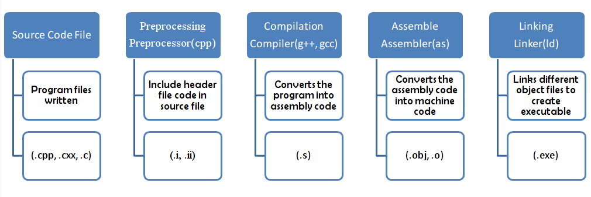

## CPP compilation phases

### Preprocessing
In this phase the preprocessor changes the `progrPreprocessingam`
according to the directives mentioned (that starts with `#` sign).
The C++ preprocessor takes the program and deals with the `#`
include directives and the resulting program is pure c++ program.
For example, in c++ program `#include<iostream>` will tell the
preprocessor to read all the contents of the `iostream` header
file and include the contents into the program and generate the
separate C++ program file. C++ supports many preprocessor
directives like `#include`, `#define`, `#if`, `#else` etc.

### Compilation
This phase translates the program into a low level `assembly level` code.
The compiler takes the `preprocessed file` ( without any directives)
and generates an object file containing `assembly level` code.
Now, the `object file` created is in the `binary form`. In the
`object file` created, `each line` describes `one low level`
`machine level instruction` . The conversion to `assembly language`
is important as it is `common output language` for many compilers
of different high-level languages.

There is also `assembly phase` which converts these `object files`
in `assembly code` into `machine level instructions` and the file
created is a `relocatable object code`. Hence, the `compilation phase`
generates the `relocatable object program` and this program can be
used in `different places` without have to compile again.

But you still `can’t run these object files` until to convert
them into executable file, now here `linker` comes into play,
which `links all the object files` to generate `single executable file`.

### Linking
Linking as the name suggests, refers to `creation of a single executable`
file from `multiple object files`. The `file created` after `linking`
is ready to be `loaded into memory` and `executed by the system`.

There is difference in `linking` and `compilation` when it comes to
`understanding errors`. `Compiler` shows `errors in syntax`, for
example `semi-colon not mentioned`, `data type not defined` etc but
if there is an error that `function has been defined multiple times`,
then this error is from `linker` as it's indicating that `two or more`
`source code files` have the `same meaning` and that is leading to
an error.

